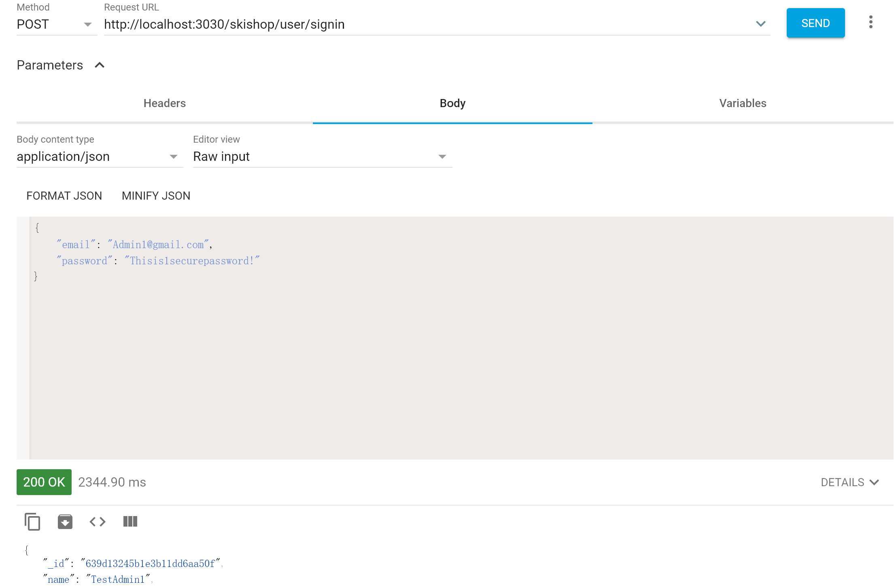
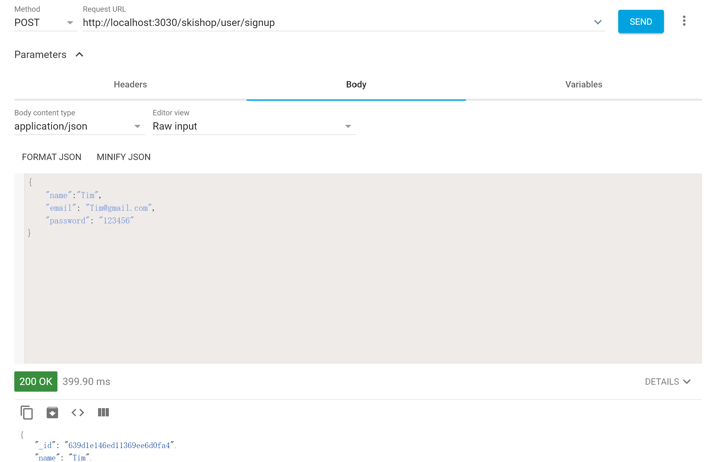

# How to run

- Clone the repo 
- Enter repo folder 
- Install dependencies for frontend and backend 
  `npm install` 
  `cd frontend` 
  `npm install` 
  (if there are npm errors, try add "--legacy-peer-deps" at the end)
- Run on localhost 
  `cd ..` 
  `npm start` 
  Open http://localhost:3030/ 
- Check backend api 
  Open http://localhost:3030/skishop/{route} 
  Replace {route} with according route
 
# Deployment
 https://ski-shop.herokuapp.com/

# Login
- Admin login 
  Email: TestAdmin1 
  Password: Thisis1securepassword! 
 
- User login 
  Email: TestUser1 
  Password: Thisisalso1securepassword! 
 
  Email: TestUser2 
  Password: Thisisalso1securepassword! 
  
 # API TEST
  The sign in and sign up api are not able to test from curl since we made it JSON form, but you can test it through Advanced REST client in Chrome,Here are
  examples of our test result (other curl commands can be found in the curl_tester.txt file)  
  
  **Sign in:**
  
  
  
  **Sign up:**
  
  
  
 # SQL FILE
  ***Sing we are using NoSQL method in our project, we do not have a SQL file to create and poplulate data. Instead, we have several mongoose Sechema components and
    seed router in our backend to simulate the creating and populating of data.***
  
